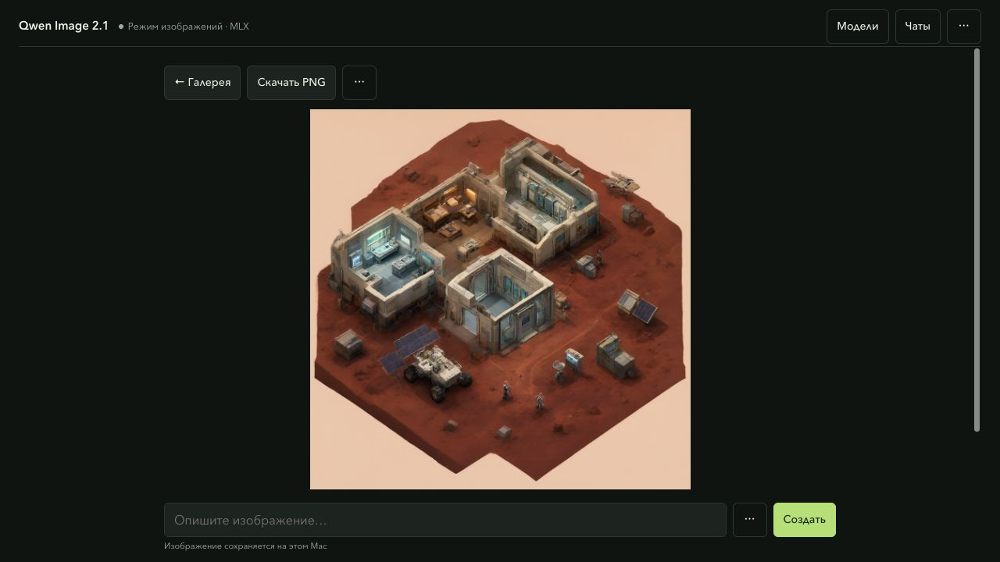
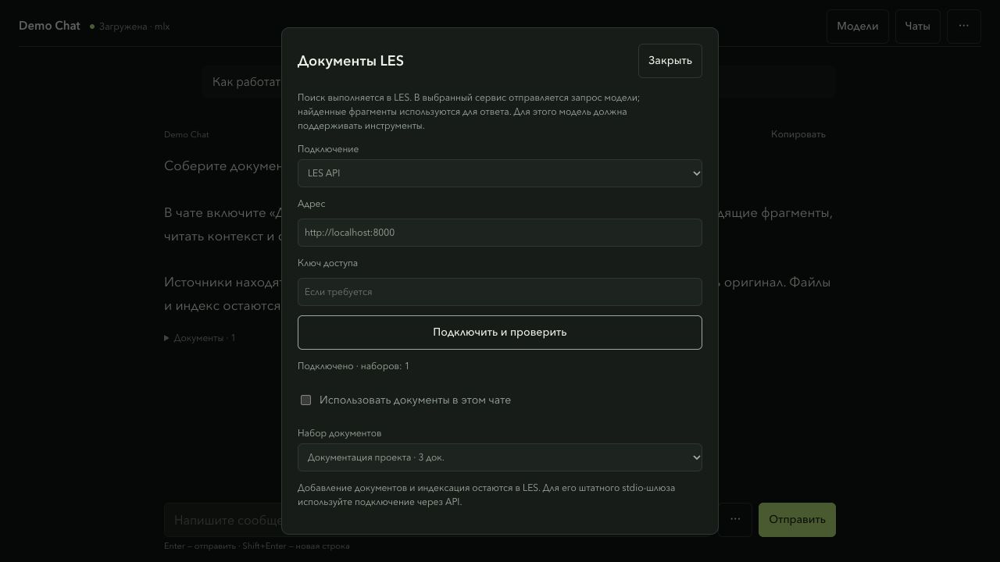

<div align="center">

# UZEL

### Local model management on Apple Silicon

A local toolkit for Apple Silicon — a model workbench and an image engine in one repository.


[Quick start](#quick-start) · [What's inside](#whats-inside) · [Screenshots](#screenshots) · [Русский](README.ru.md)

</div>



## What's inside

| Component | What it does |
| --- | --- |
| **[Manager](manager/README.md)** | Finds local models and oMLX / MLX LM engines. Starts a selected model, streams chats, saves conversations and drafts, displays image progress, and connects LES document retrieval. |
| **[Image Kit](image-kit/README.md)** | Qwen Image 2.1 with a native 4-bit MLX loader. Interactive, direct and batch generation; optional denoising cache. |
| **[Launcher](run.py)** | `manager`, `image` and `check` from the toolkit root. |

The two components keep their own code and tests. Image generation retains
Image Kit's native Q4 loader and sampling settings; the manager adds exact
conditioning reuse and resident series. Models and text inference
engines are installed separately. Model weights are not included.

## Quick start

Requires **macOS on Apple Silicon** and **Python 3.12+**.

**Chat also requires a separately installed
[MLX LM](https://github.com/ml-explore/mlx-lm) or
[oMLX](https://github.com/jundot/omlx) engine and downloaded text-model weights.**
The installation below includes Manager and Image Kit; text engines and model
weights are not included.

```sh
git clone https://github.com/proovcme/uzel.git
cd uzel
python3.12 -m venv .venv
.venv/bin/python -m pip install ./image-kit
.venv/bin/python run.py
```

Open **http://127.0.0.1:1924/**. Select a model, click **Start**, and write a prompt.
The composer switches between chat and image controls when you select a model.

For optional **web search with sources** in chat, install `.venv/bin/python -m pip install -r manager/requirements-web.txt` and enable it in the **⋯ menu beside the message field**. See [setup and privacy boundaries](docs/web-search.md).

For text models, install **[oMLX](https://github.com/jundot/omlx)** or
**[MLX LM](https://github.com/ml-explore/mlx-lm)** separately. The manager discovers
existing executables on PATH, in Homebrew and in `uv tool` environments. Local
models are found in the Hugging Face cache, `~/models`, `~/.omlx/models` and
`~/.lmstudio/models`.

Image generation in the manager needs a complete cached
`mlx-community/Qwen-Image-2.1-MLX-4bit` snapshot. To download missing weights
through Image Kit and start its interactive CLI:

```sh
.venv/bin/python run.py image
```

Image Kit can download missing model files; the manager itself never downloads
or starts a model implicitly. See [model and license details](image-kit/README.md#model-and-license).

## Screenshots

### More room for the answer

One compact header keeps the selected model and its live status visible.
**Чаты** opens saved conversations; model controls and diagnostics stay out of the
reading area. Search, document retrieval and parameters open from the composer menu.


<details>
<summary>Mobile / Мобильный чат</summary>


</details>

Replies arrive as a stream. Prompt processing, reasoning and answering have
visible states. Conversations, partial replies, system prompts, parameters and
drafts are saved locally; **New Chat** keeps earlier conversations in history.

### Generation you can follow


Follow generation stages, steps and elapsed time. Download completed images as
PNG, reuse saved parameters or move gallery items to recoverable local trash.
[Prompts, limits and series](image-kit/docs/manager-workflow.md).

<details>
<summary>Gallery</summary>


</details>

All UI screenshots use an isolated demo service, synthetic chat/document/progress
states and public Image Kit showcase images. They illustrate the current interface;
they are not performance measurements or proof of a live LES deployment. No private
history, local model identities, credentials or machine paths are included.

## Documents through LES



Open **⋯ → Документы LES**, connect a running [LES RAG](https://github.com/proovcme/LES)
API, select a document set and enable it for chat. A model with function-call support
chooses search queries and reads retrieved context. Answers stream normally with
collapsible source excerpts and original-document links using `[D1]` citations.
An unavailable index or unsupported model produces an explicit error.

Files, OCR, ingestion and indexing remain in LES. Manager does not copy the corpus,
start LES or manage its embedding model. Direct API is the connection for the standard
LES app; optional HTTP MCP requires a compatible gateway exposing `list_datasets`
and `search_sources`. Its bundled stdio server is not launched by Manager.
[Setup, API contract and privacy boundaries](docs/les-rag.md).

## From an idea to an image series

Choose Qwen Image and open **⋯ → Настройки изображения**. Optionally expand
the prompt with an installed text model, review it, and set **В серии** to 1–20.
Manager generates the images sequentially with different seeds; completed
images stay in the gallery.

[Prompt expansion, series and cancellation — Image Kit guide](image-kit/docs/manager-workflow.md).

## A few commands

```sh
.venv/bin/python run.py                 # model workbench
.venv/bin/python run.py image           # interactive image CLI
.venv/bin/python run.py image direct --help # direct generation options
.venv/bin/python manager/cli.py status
.venv/bin/python run.py check           # both Python suites + SSE parser
```

The check command runs both Python suites, JavaScript syntax and all JavaScript
UI/streaming checks. It requires the installed Image Kit dependencies, downloads
no models and starts no image benchmark. [CI](.github/workflows/checks.yml) checks
the manager on Linux and image contracts on macOS. Metal parity checks explicitly
skip on runners without a GPU. LES transport/tool tests use synthetic services;
compatibility with an installed LES and a particular model must be verified separately.
See the [installation and recovery checks](docs/reliability.md) for their scope.

## Local by design

- One managed heavy workload at a time. Active requests and external-process
  conflicts block unsafe switching.
- After a service restart, only recorded processes with matching PID, birth time,
  command and process group are recovered.
- Deleting a model previews its folder and requires typing its name. The model
  moves to recoverable Trash, including its HF blobs, refs and snapshots.
- User data stays in `~/.local/share/mlx-manager`. Chats and image prompts are
  stored there intentionally; they are excluded from Git.

The control plane listens on loopback and has no authentication. Use it on a
trusted local machine; do not expose its port to a network. Direct launches
outside the manager can bypass its resource lock. The current chat composer
accepts text; image attachments for VLMs are not implemented yet.

**Vanilla image generation** is the reference. `balanced` caching is optional
and can change an image; the paired measurements and limits are documented in
[Image Kit](image-kit/README.md#measured-off-vs-balanced).

## Documentation

[Manager setup & API](manager/README.md) · [Image generation & batch](image-kit/README.md) ·
[Русская документация](README.ru.md) · [MIT license](LICENSE)

UZEL was previously named MLX Manager. Existing data directories and
`MLX_MANAGER_*` settings remain compatible; new settings may use `UZEL_*`.
