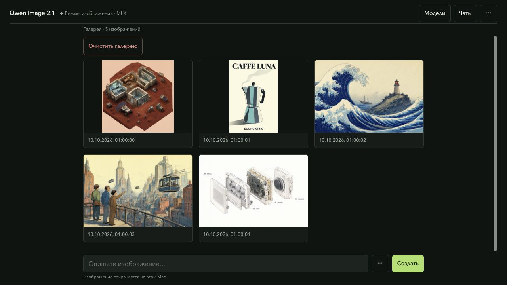
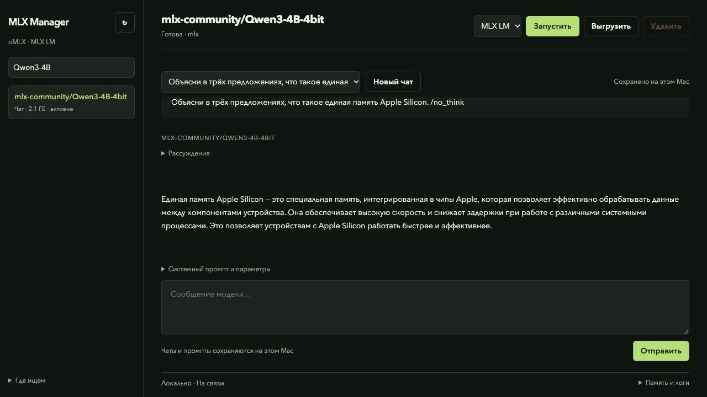
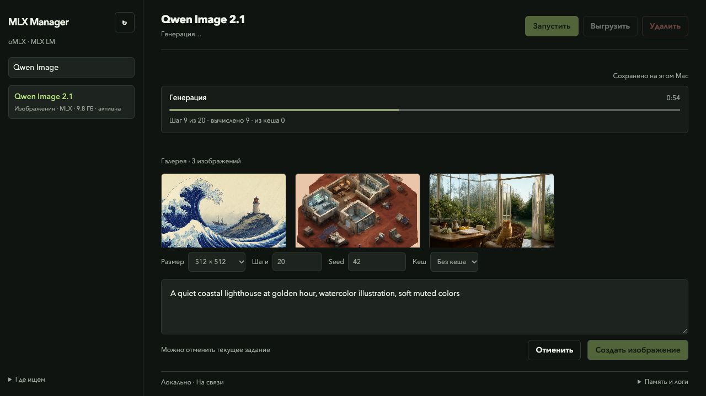
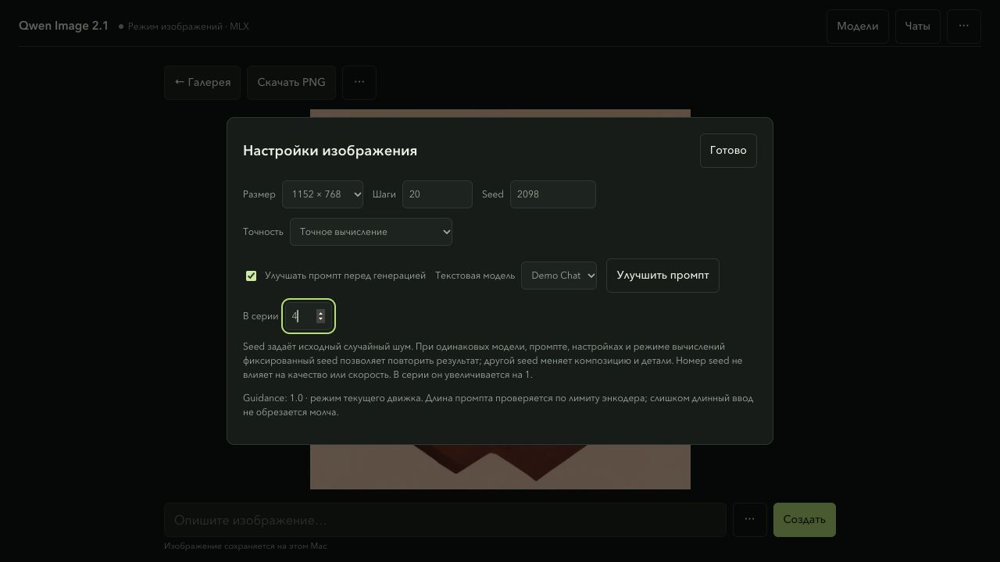

<div align="center">

# MLX Manager

### Models. Chat. Images. On your Mac.

A local toolkit for Apple Silicon — a model workbench and an image engine in one repository.


[Quick start](#quick-start) · [What's inside](#whats-inside) · [Screenshots](#screenshots) · [Русский](README.ru.md)

</div>



## What's inside

| Component | What it does |
| --- | --- |
| **[Manager](manager/README.md)** | Finds local models and oMLX / MLX LM engines. Starts a selected model, streams chats, saves conversations and drafts, and displays image progress. |
| **[Image Kit](image-kit/README.md)** | Qwen Image 2.1 with a native 4-bit MLX loader. Interactive, direct and batch generation; optional denoising cache. |
| **[Launcher](run.py)** | `manager`, `image` and `check` from the toolkit root. |

The two components keep their own code and tests. Image generation retains
Image Kit's native Q4 loader and sampling settings; the manager adds exact
conditioning reuse and resident series. Models and text inference
engines are installed separately. Model weights are not included.

## Quick start

Requires **macOS on Apple Silicon** and **Python 3.12+**.

```sh
git clone https://github.com/proovcme/mlx-manager.git
cd mlx-manager
python3.12 -m venv .venv
.venv/bin/python -m pip install ./image-kit
.venv/bin/python run.py
```

Open **http://127.0.0.1:1924/**. Select a model, click **Start**, and write a prompt.
The composer switches between chat and image controls when you select a model.

For text models, install **[oMLX](https://github.com/jundot/omlx)** or
**[MLX LM](https://github.com/ml-explore/mlx-lm)** separately. The manager discovers
existing executables on PATH, in Homebrew and in `uv tool` environments. Local
models are found in the Hugging Face cache, `~/models`, `~/.omlx/models` and
`~/.lmstudio/models`.

Image generation in the manager needs a complete cached
`mlx-community/Qwen-Image-2.1-MLX-4bit` snapshot. To download missing weights
through Image Kit and start its interactive CLI:

```sh
.venv/bin/python run.py image
```

Image Kit can download missing model files; the manager itself never downloads
or starts a model implicitly. See [model and license details](image-kit/README.md#model-and-license).

## Screenshots

### A conversation that stays with you



Replies arrive as a stream. Prompt processing, reasoning and answering have
visible states. Conversations, partial replies, system prompts, parameters and
drafts are saved locally; **New Chat** keeps earlier conversations in history.

### Generation you can follow



Follow encoder loading, denoising steps, cache counters, decoding and elapsed
time. Completed images go into the gallery, with PNG download and parameter
reuse. Old images without recorded parameters remain viewable.

Screenshots use an isolated local workspace, a neutral chat with a real local
model and public Image Kit showcase images. They contain no private conversation
history, machine paths or model weights.

## From an idea to an image series



Choose Qwen Image and enable **Улучшать промпт перед генерацией** (expand before generating).
Select an installed text model; a small Qwen3-4B is a practical starting point.
**Улучшить промпт** previews a rewrite without rendering. You can edit the resulting
prompt or restore your original idea. The automatic mode rewrites once, unloads the
text model, then generates images sequentially. No weights are downloaded.

Set **В серии** to 1–20. Each image uses the same prompt and settings, with seeds
`seed`, `seed + 1`, and so on (wrapping at 32 bits). The UI shows the image number
and its generation steps. Stop cancels the current image and all remaining images;
completed images stay in the gallery. Refreshing the page retains control. Restarting
the service interrupts the pending queue; it does not automatically launch more images.

The compact local instructions follow Qwen's
[documented prompt rewrite approach](https://github.com/QwenLM/Qwen-Image-2.1/tree/main/prompt_rewrite):
a description of the finished frame, composition, materials and lighting; requested
lettering keeps its original script. This uses your chosen general text model,
not the dedicated PE checkpoint. A rewrite adds creative details and can alter the
result; review it when exact fidelity matters. Inference settings remain under your control.
Original and expanded prompts stay in local history. Failed or truncated rewrites
stop the workflow instead of being passed to the image model.

[Exact acceleration measurements](docs/acceleration.md) · [Reference-image investigation](docs/reference-images.md)

## A few commands

```sh
.venv/bin/python run.py                 # model workbench
.venv/bin/python run.py image           # interactive image CLI
.venv/bin/python run.py image direct --help # direct generation options
.venv/bin/python manager/cli.py status
.venv/bin/python run.py check           # both Python suites + SSE parser
```

**105 Python tests** pass across both components (48 manager + 57 image engine),
plus JavaScript syntax and SSE parser checks. These checks need the installed
Image Kit dependencies; they do not download models or run a GPU benchmark.
The optional [CI template](ci/checks.yml.example) is provided separately.
See the [installation and recovery checks](docs/reliability.md) for their scope.

## Local by design

- One managed heavy workload at a time. Active requests and external-process
  conflicts block unsafe switching.
- After a service restart, only recorded processes with matching PID, birth time,
  command and process group are recovered.
- Deleting a model previews its folder and requires typing its name. The model
  moves to recoverable Trash, including its HF blobs, refs and snapshots.
- User data stays in `~/.local/share/mlx-manager`. Chats and image prompts are
  stored there intentionally; they are excluded from Git.

The control plane listens on loopback and has no authentication. Use it on a
trusted local machine; do not expose its port to a network. Direct launches
outside the manager can bypass its resource lock. The current chat composer
accepts text; image attachments for VLMs are not implemented yet.

**Vanilla image generation** is the reference. `balanced` caching is optional
and can change an image; the paired measurements and limits are documented in
[Image Kit](image-kit/README.md#measured-off-vs-balanced).

## Documentation

[Manager setup & API](manager/README.md) · [Image generation & batch](image-kit/README.md) ·
[Русская документация](README.ru.md) · [MIT license](LICENSE)
