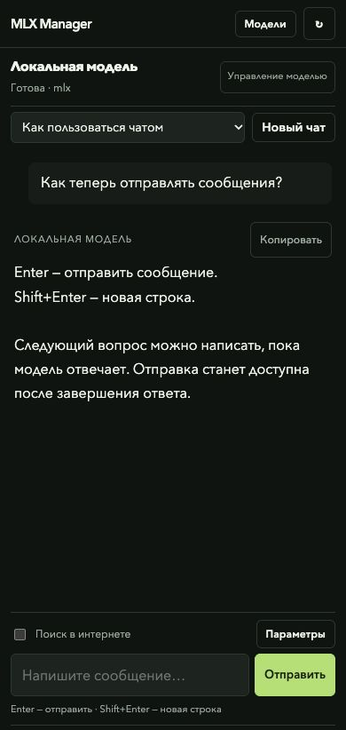

<div align="center">

# MLX Manager

### Модели. Чат. Изображения. На вашем Mac.

Локальный пакет для Apple Silicon: менеджер моделей и движок генерации в одном репозитории.


[Запуск](#быстрый-запуск) · [Что внутри](#что-внутри) · [Скриншоты](#скриншоты) · [English](README.md)

</div>


## Что внутри

| Компонент | Возможности |
| --- | --- |
| **[Менеджер](manager/README.ru.md)** | Поиск локальных моделей и движков oMLX / MLX LM, запуск, потоковый чат, сохранение разговоров и черновиков, улучшение промптов, серии и прогресс генерации. |
| **[Image Kit](image-kit/README.ru.md)** | Qwen Image 2.1, нативная загрузка 4-битных весов в MLX, интерактивная, прямая и пакетная генерация, дополнительный кеш денойзинга. |
| **[Общий запуск](run.py)** | Команды `manager`, `image` и `check` из корня пакета. |

У компонентов отдельные код и тесты. Генерация сохраняет нативную Q4-загрузку
и параметры сэмплинга Image Kit; менеджер добавляет точное переиспользование
состояния промпта и серии с моделями в памяти. Веса моделей и текстовые движки
устанавливаются отдельно.

## Быстрый запуск

Нужны **Mac с Apple Silicon** и **Python 3.12+**.

```sh
git clone https://github.com/proovcme/mlx-manager.git
cd mlx-manager
python3.12 -m venv .venv
.venv/bin/python -m pip install ./image-kit
.venv/bin/python run.py
```

Откройте **http://127.0.0.1:1924/**. Выберите модель, нажмите «Запустить»
и введите промпт. При выборе модели интерфейс переключается между чатом
и параметрами изображения.

Для текстовых моделей отдельно установите
**[oMLX](https://github.com/jundot/omlx)** или
**[MLX LM](https://github.com/ml-explore/mlx-lm)**. Менеджер обнаруживает движки
в PATH, Homebrew и окружениях `uv tool`; модели — в HF-кеше, `~/models`,
`~/.omlx/models` и `~/.lmstudio/models`.

Для генерации через менеджер нужен полный скачанный snapshot
`mlx-community/Qwen-Image-2.1-MLX-4bit`. Загрузить недостающие веса
и открыть интерактивную генерацию можно через Image Kit:

```sh
.venv/bin/python run.py image
```

Image Kit умеет скачивать недостающие файлы модели. Сам менеджер ничего
не скачивает и не загружает модель без явного запуска. Условия использования
весов описаны в документации [Image Kit](image-kit/README.ru.md).

Для **поиска в интернете с источниками** установите `.venv/bin/python -m pip install -r manager/requirements-web.txt` и включите переключатель в чате. [Настройка и ограничения](docs/web-search.md).

## Скриншоты

### Разговор сохраняется

Скриншоты чата сделаны с нейтральной демонстрационной историей.


<details>
<summary>Mobile / Мобильный чат</summary>



</details>

Ответ идёт потоком. Видны обработка промпта, рассуждение и ответ.
Разговоры, полученная часть прерванного ответа, системные промпты,
параметры и черновики сохраняются на диске. «Новый чат» оставляет
предыдущие разговоры в истории.

### Генерация видна по шагам


Видны загрузка энкодера, шаги денойзинга, счётчики кеша, декодирование
и время выполнения. Готовые изображения появляются в галерее:
можно скачать PNG или восстановить параметры для повторной генерации.
У старых изображений без записанного промпта параметры восстановить нельзя.

Скриншоты сделаны в отдельном локальном рабочем пространстве с нейтральным
чатом и публичными примерами Image Kit. Личной истории, путей компьютера
и весов моделей в них нет.

## От идеи к серии изображений


Выберите Qwen Image и включите **«Улучшать промпт перед генерацией»**.
Укажите установленную текстовую модель; начать можно с небольшой Qwen3-4B.
Кнопка **«Улучшить промпт»** показывает результат без генерации: его можно
отредактировать или вернуть исходный замысел. В автоматическом режиме промпт
расширяется один раз, текстовая модель выгружается, затем создаются изображения.
Новые веса не скачиваются.

В поле **«В серии»** задайте от 1 до 20 изображений. Промпт и параметры одинаковые,
seed меняется: исходный, исходный + 1 и далее, с переходом через границу 32 бит.
Виден номер изображения и прогресс по шагам. Остановка отменяет текущее изображение
и оставшиеся; готовые остаются в галерее. Обновление страницы сохраняет управление.
После перезапуска сервиса очередь прерывается, новые изображения сами не запускаются.

Локальная инструкция следует
[методу переписывания промптов Qwen](https://github.com/QwenLM/Qwen-Image-2.1/tree/main/prompt_rewrite):
описание готового кадра, композиции, материалов и освещения; заданные надписи
сохраняются на исходном языке. Используется выбранная обычная текстовая модель,
а не специализированный PE checkpoint. Она добавляет творческие детали и может
изменить результат — проверяйте промпт, если нужно точное соответствие замыслу.
Исходный и расширенный промпты сохраняются локально. Ошибка или незаконченный ответ
останавливают цепочку. Параметры генерации остаются под вашим контролем.

[Замеры точного ускорения](docs/acceleration.md) · [Референсы: состояние адаптера](docs/reference-images.md)

## Несколько команд

```sh
.venv/bin/python run.py                 # менеджер моделей
.venv/bin/python run.py image           # интерактивная генерация
.venv/bin/python run.py image direct --help # прямая генерация
.venv/bin/python manager/cli.py status
.venv/bin/python run.py check           # проверки обоих компонентов
```

Проходят **125 Python-тестов**: 68 у менеджера и 57 у Image Kit,
а также проверка синтаксиса JavaScript и парсера SSE. Для полного набора
нужны установленные зависимости Image Kit. Проверки не скачивают модели
и не запускают GPU-бенчмарк. [CI](.github/workflows/checks.yml) проверяет менеджер на Linux и контракты Image Kit на macOS. Тесты Metal явно пропускаются на раннерах без GPU; локально проверены все 125 Python-тестов.

## Локальная работа

- Один управляемый тяжёлый процесс одновременно. Активные запросы
  и конфликт с внешним процессом блокируют переключение.
- После перезапуска сервис восстанавливает собственные процессы по PID,
  времени запуска, команде и группе процесса.
- Удаление показывает папку и требует ввода имени модели. Папка перемещается
  в корзину вместе с HF blobs, refs и snapshots; её можно вернуть обратно.
- Данные хранятся в `~/.local/share/mlx-manager`. Чаты и промпты сохраняются
  там намеренно; в Git они не входят.

Сервис слушает только loopback, аутентификации нет. Используйте его на
доверенном локальном компьютере и не открывайте порт в сеть. Прямой запуск
движков за пределами менеджера может обойти его блокировку ресурсов.
Чат пока принимает текст; прикрепление изображений для VLM ещё не реализовано.

**Генерация без кеша** — эталонный режим. `balanced` ускоряет вычисления
с возможным изменением изображения. Измерения и ограничения приведены
в [Image Kit](image-kit/README.ru.md).

## Документация

[Настройка менеджера](manager/README.ru.md) · [Генерация и batch](image-kit/README.ru.md) ·
[English](README.md) · [Лицензия MIT](LICENSE)
